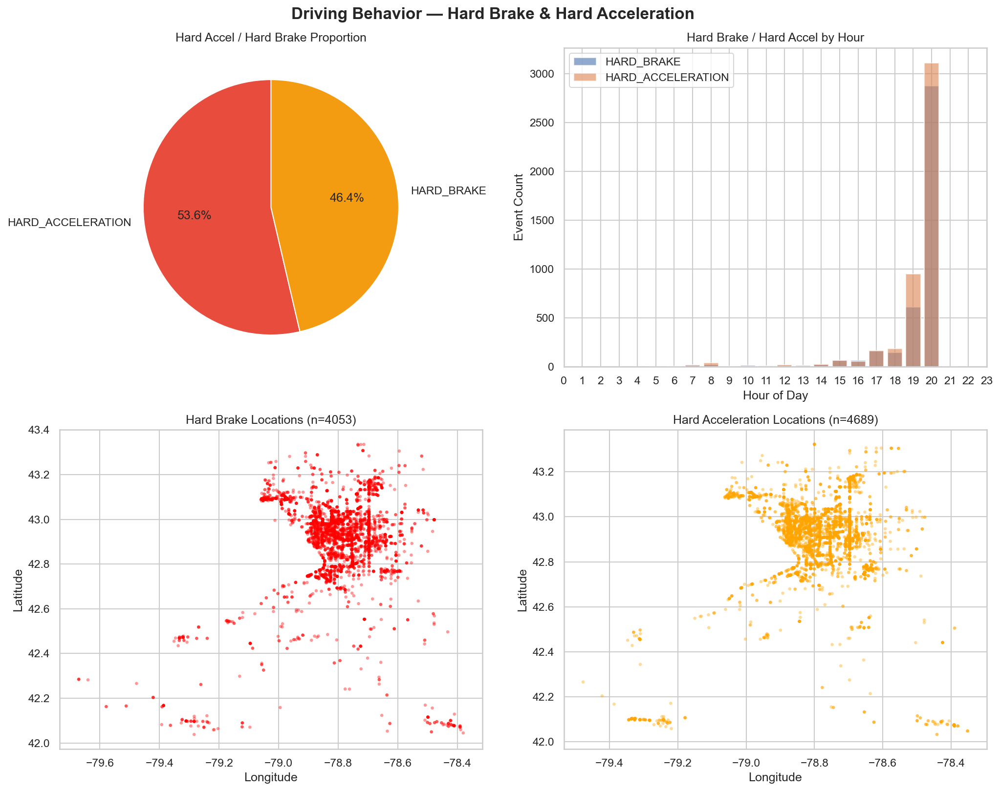
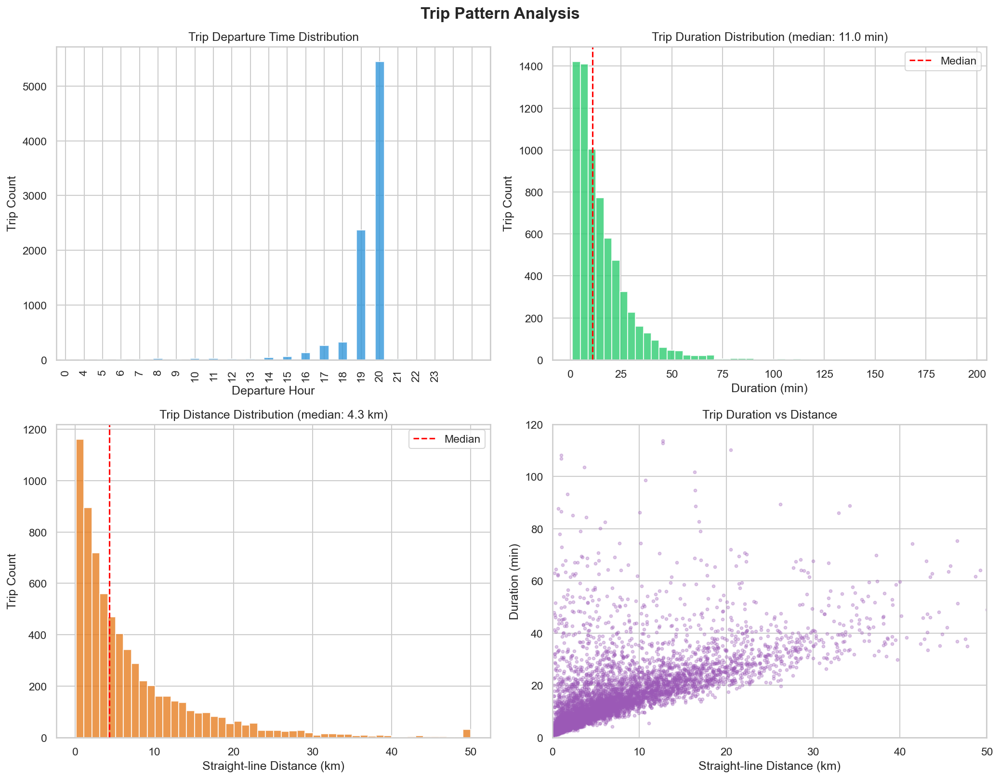
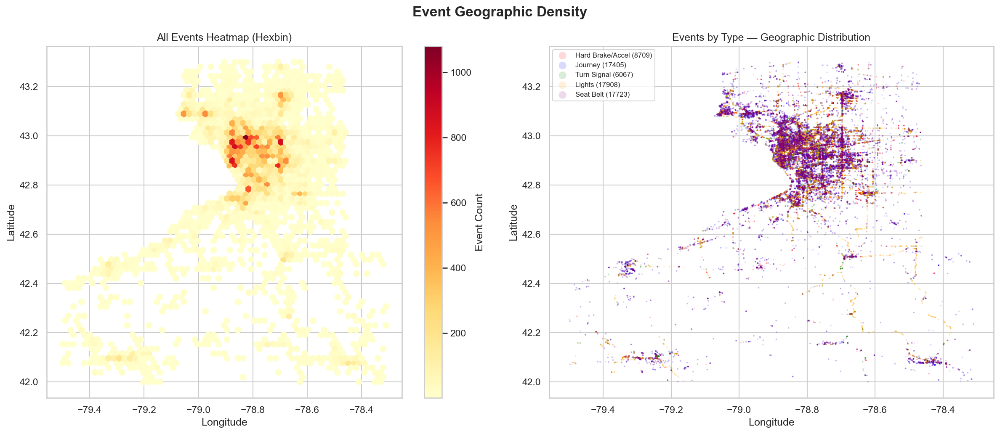
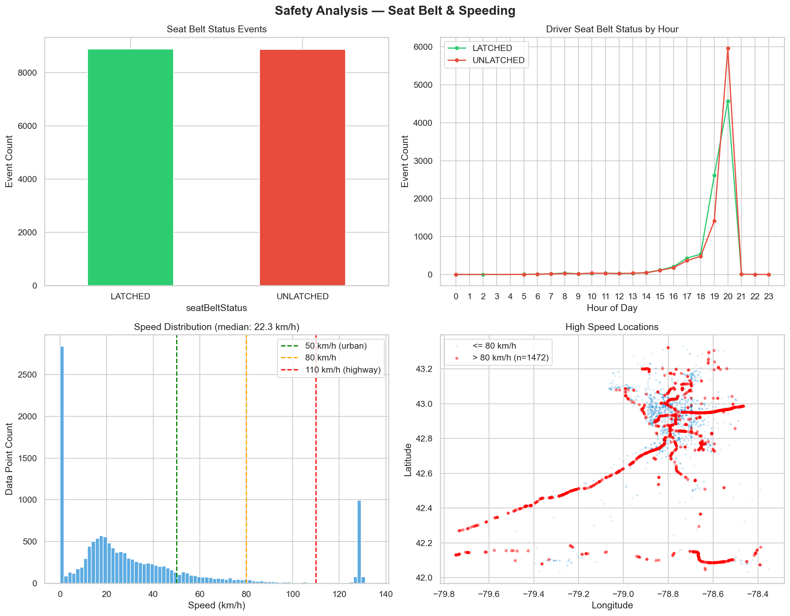

# Traffic Telematics Data Analysis

Analyzing vehicle telematics data from the Buffalo, NY area (2022-09-28). Covers driving behavior, trip patterns, geographic event density, and safety metrics.

## Project Structure

```
traffic_data_analysis/
├── code/
│   └── traffic_analysis.py    # Main analysis script
├── data/
│   └── 2022-09-28_00.csv      # Raw telematics data
├── outputs/                    # Generated charts (after running)
├── diagnosis/
├── README.md
└── .gitignore
```

## Quick Start

### 1. Install Dependencies

Requires Python 3.8+. Check with:
```bash
python3 --version
```

Install all dependencies:
```bash
pip3 install --upgrade pandas matplotlib seaborn folium scipy
```

> **Important:** Use `--upgrade` to ensure all packages are compatible with each other. See [Troubleshooting](#troubleshooting) if you run into NumPy/SciPy version conflicts.

### 2. Edit Paths in Script

Open `code/traffic_analysis.py`, find these two lines near the top and set them to your local paths:

```python
CSV_PATH = "/home/Desktop/traffic_data_analysis/data/2022-09-28_00.csv"
OUTPUT_DIR = "/home/Desktop/traffic_data_analysis/outputs"
```

### 3. Run

```bash
cd code/
python3 traffic_analysis.py
```

## Analysis Overview

The script performs four analyses:

**1. Driving Behavior** — Hard braking and hard acceleration event distribution, hourly patterns, and geographic hotspots.

**2. Trip Patterns** — Departure time distribution, trip duration, straight-line distance, and duration-vs-distance correlation.

**3. Geographic Heatmap** — Event density hexbin map and per-event-type scatter plot. Also generates an interactive HTML heatmap (via Folium).

**4. Safety Analysis** — Seat belt latched/unlatched events by hour, speed distribution with urban/highway thresholds, and high-speed location mapping.

## Output Files

After running, the following files will be generated in `outputs/`:

| File | Description |
|------|-------------|
| `1_driving_behavior.png` | Hard brake & hard acceleration charts |
| `2_trip_patterns.png` | Trip duration, distance, departure time |
| `3_geo_heatmap.png` | Event density heatmap (static) |
| `3_interactive_heatmap.html` | Event density heatmap (interactive, open in browser) |
| `4_safety_analysis.png` | Seat belt usage & speeding analysis |

### Sample Outputs









> If the images above don't render, run the script first to generate them in `outputs/`.

## Troubleshooting

### NumPy / Matplotlib incompatibility

```
AttributeError: _ARRAY_API not found
ImportError: numpy.core.multiarray failed to import
```

This happens when the system-installed matplotlib (compiled with NumPy 1.x) conflicts with a newer NumPy 2.x. Fix:

```bash
pip3 install --upgrade matplotlib
```

### NumPy / SciPy incompatibility

```
ValueError: numpy.dtype size changed, may indicate binary incompatibility
```

The system SciPy is too old for your NumPy version. Fix:

```bash
pip3 install --upgrade scipy seaborn matplotlib
```

### General "ModuleNotFoundError"

```
ModuleNotFoundError: No module named 'xxx'
```

Simply install the missing package:

```bash
pip3 install xxx
```

### CSV parsing error

Make sure the CSV path in the script is correct and the file is not open in another program (e.g. Excel).

### Plots have overlapping text

Reduce DPI in the script — change `plt.rcParams['figure.dpi'] = 150` to `100`.
